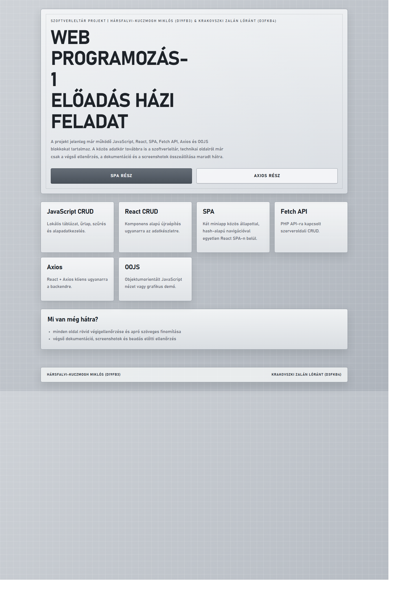
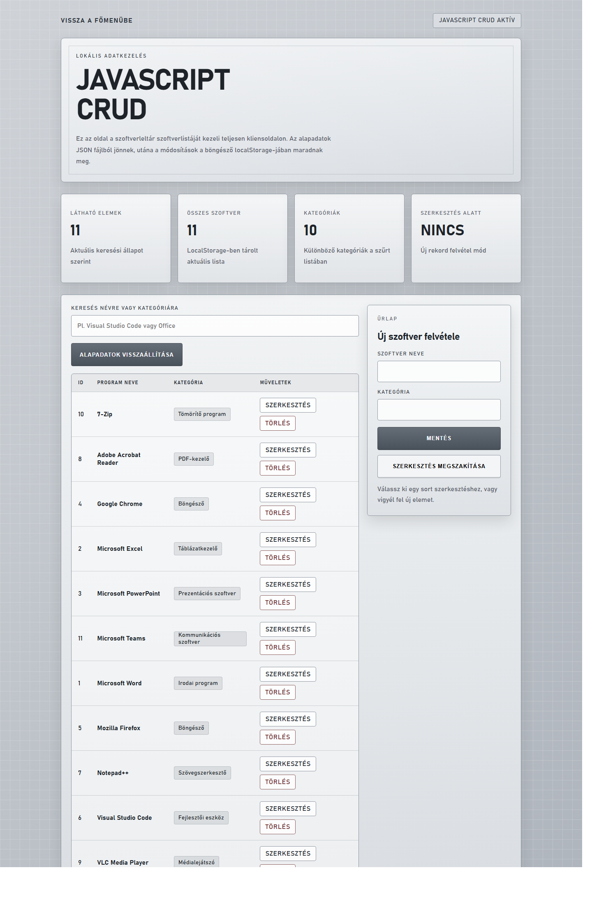
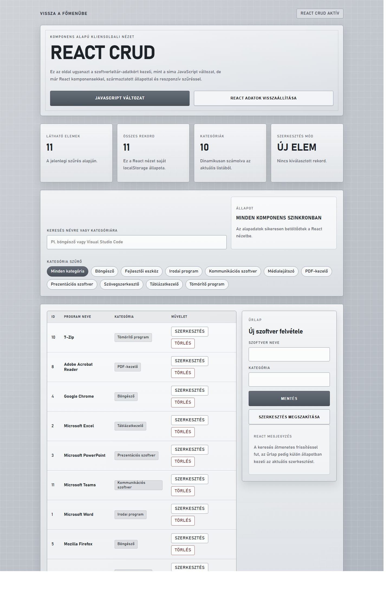
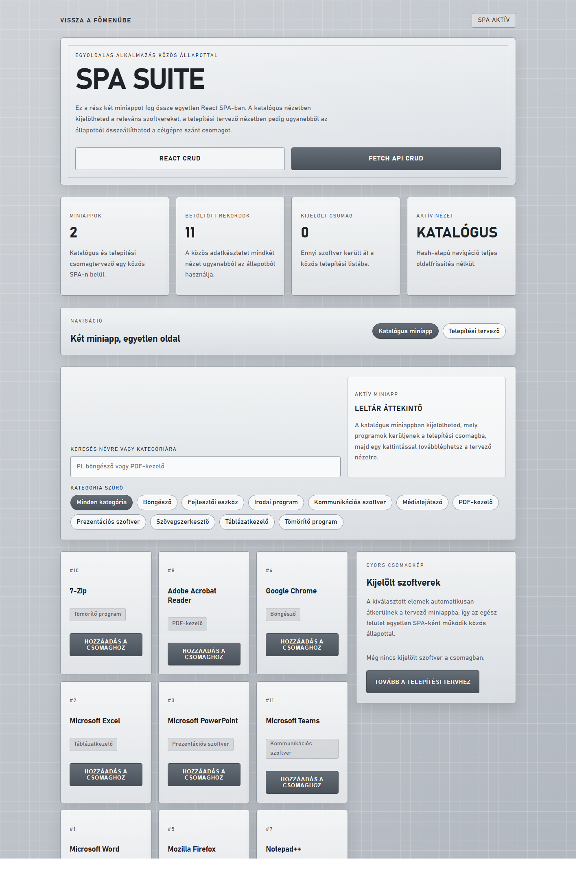
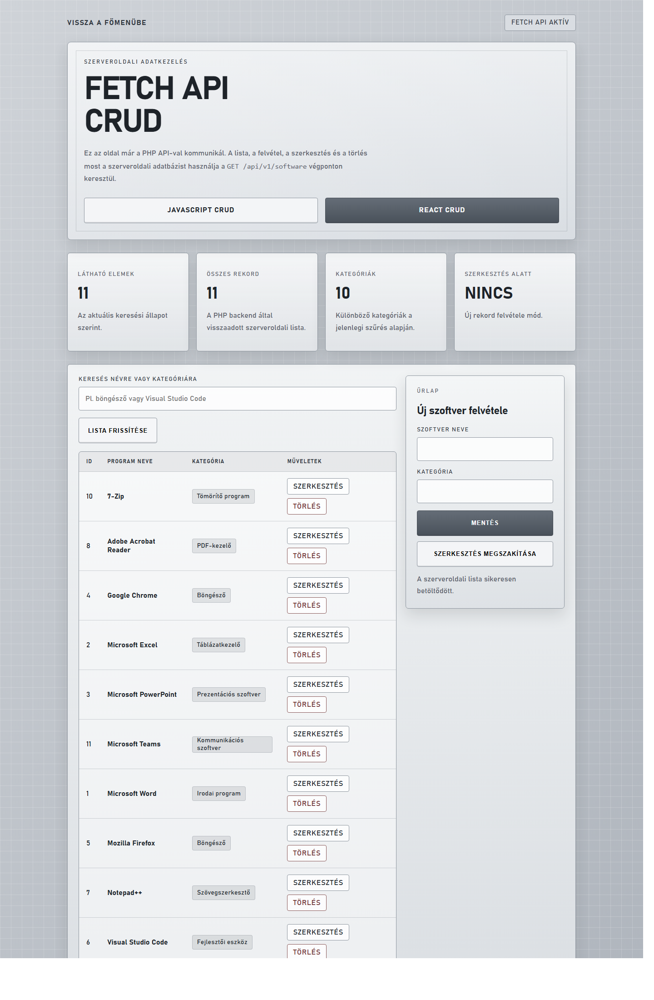
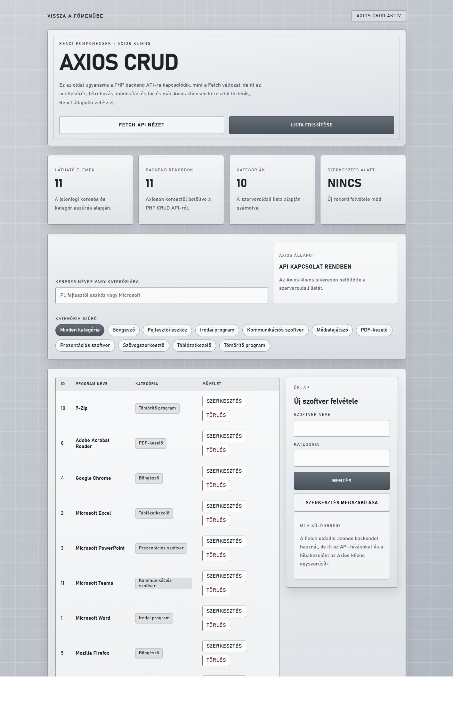
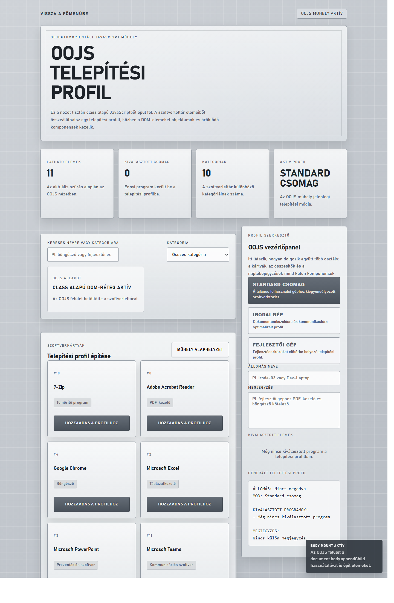
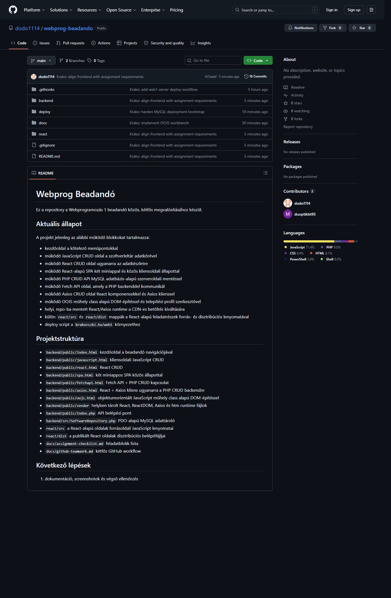
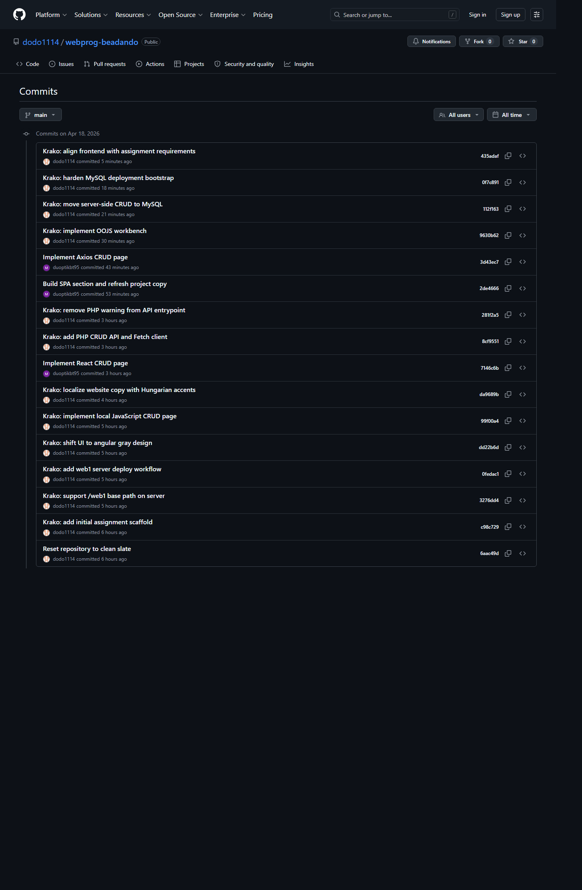

# Webprogramozás 1 beadandó dokumentáció

## 1. Címlap

**Tárgy:** Webprogramozás 1  
**Beadandó típusa:** közös, kétfős féléves beadandó  
**Projekt címe:** Szoftverleltár  
**Készítők:** Hársfalvi-Kuczmogh Miklós (`D19FB3`) és Krakovszki Zalán Lóránt (`D3FKB4`)  
**GitHub repository:** [https://github.com/dodo1114/webprog-beadando](https://github.com/dodo1114/webprog-beadando)  
**Élő URL:** [https://krakovszki.hu/web1/](https://krakovszki.hu/web1/)  
**Dokumentáció dátuma:** 2026. április 18.

## 2. A beadandó célja

A beadandó célja egy olyan többoldalas webes alkalmazás elkészítése volt, amely a tárgyi kiírás összes fő technológiai blokkját egyetlen közös témára, az `1-11 szoftverleltár` adatkörre fűzi fel. A rendszer feladata a szoftverállomány áttekintése, keresése, karbantartása és több eltérő frontend-megközelítés bemutatása.

A projekt úgy lett kialakítva, hogy:

- teljesítse a JavaScript, React, SPA, Fetch API, Axios és OOJS feladatrészeket
- külön szerveroldali CRUD végpontot adjon PHP alapon
- élő hoszton fusson
- GitHubon kétfős munkával, látható commit-historyval készüljön

## 3. Projektazonosítók és elérhetőségek

### 3.1 Publikus elérhetőségek

- Főoldal: [https://krakovszki.hu/web1/](https://krakovszki.hu/web1/)
- JavaScript CRUD: [https://krakovszki.hu/web1/javascript.html](https://krakovszki.hu/web1/javascript.html)
- React CRUD: [https://krakovszki.hu/web1/react.html](https://krakovszki.hu/web1/react.html)
- SPA: [https://krakovszki.hu/web1/spa.html](https://krakovszki.hu/web1/spa.html)
- Fetch API: [https://krakovszki.hu/web1/fetchapi.html](https://krakovszki.hu/web1/fetchapi.html)
- Axios: [https://krakovszki.hu/web1/axios.html](https://krakovszki.hu/web1/axios.html)
- OOJS: [https://krakovszki.hu/web1/oojs.html](https://krakovszki.hu/web1/oojs.html)
- API health: [https://krakovszki.hu/web1/api/v1/health](https://krakovszki.hu/web1/api/v1/health)
- API software lista: [https://krakovszki.hu/web1/api/v1/software](https://krakovszki.hu/web1/api/v1/software)

### 3.2 Repository

- GitHub: [https://github.com/dodo1114/webprog-beadando](https://github.com/dodo1114/webprog-beadando)
- Aktív branch: `main`
- Távoli collaborator: `duoptikbt95`

### 3.3 Ellenőrző felhasználó

- Az ellenőrzéshez szükséges belépési adatok biztonsági okból nem szerepelnek a publikus repositoryban.
- A végleges, beadott PDF csomag tartalmazza a szükséges hozzáféréseket.

### 3.4 Ellenőrzési hozzáférések

- Az élő URL-ek és a tesztfelhasználó publikusak, ezért ezek a GitHub repó dokumentációjában is szerepelnek.
- A tárhelyhez tartozó SSH/SFTP/FTP hozzáférési adatok, valamint az adatbázis-hozzáférés részletei biztonsági okból nem kerülnek be a publikus GitHub repóba.
- Az ellenőrzéshez szükséges érzékeny hozzáférési adatok a beadott, végleges PDF dokumentációban kerülnek átadásra.

### 3.5 Regisztrációs védelem

- A regisztrációs űrlap szerveroldalon ellenőrzött, matematikai captcha feladatot használ.
- Hibás captcha válasz esetén a regisztráció blokkolódik, új feladat generálódik, és a felhasználó hibaüzenetet kap.

## 4. Funkcionális áttekintés

A rendszer hét publikus felületet tartalmaz:

1. **Kezdőoldal**
   összefoglalja a projekt állapotát, tartalmazza a kötelező H1 címet, a navigációt és a készítők adatait.
2. **JavaScript CRUD**
   kliensoldali táblázatos kezelés szűréssel, űrlappal és lokális adattárolással.
3. **React CRUD**
   React alapú újraépítés ugyanarra az adatkörre.
4. **SPA**
   hash-alapú, két miniappot egyesítő kliensoldali alkalmazás közös állapottal.
5. **Fetch API**
   böngésző oldali kliens, amely a PHP API-n keresztül szerveroldali mentést végez.
6. **Axios**
   React + Axios kliens ugyanarra a MySQL-backed API-ra kötve.
7. **OOJS**
   objektumorientált JavaScript műhely, ahol class, extends, super, konstruktorok és dinamikus DOM-építés szerepelnek.

A portál része továbbá a belépés / regisztráció oldal, ahol a regisztrációs folyamat captcha-védelemmel egészül ki.

## 5. Használt technológiák

### 5.1 Frontend

- HTML5
- CSS3
- natív JavaScript
- helyben tárolt React runtime
- helyben tárolt ReactDOM runtime
- helyben tárolt Axios kliens
- helyben tárolt `htm` runtime

### 5.2 Backend

- PHP
- PDO
- MariaDB / MySQL
- JSON alapú seedadat

### 5.3 Üzemeltetés

- Apache
- Linux szerver
- deploy script
- GitHub alapú verziókezelés

## 6. Adatmodell

Az alkalmazás alapja a szoftverleltár. Az egyes rekordok a gyakorlatban az alábbi mezőket tartalmazzák:

- azonosító
- szoftver neve
- gyártó vagy kategória
- verzió
- licenc típus
- platform
- telepítési vagy készletállapot
- megjegyzés

Az adatokat a kliensoldali példák és a szerveroldali CRUD közös sémával használják, így ugyanarra az adatkörre tud ráépülni a JavaScript, a React, a Fetch és az Axios rész is.

## 7. Követelmények teljesülése

| Követelmény | Megvalósítás |
| --- | --- |
| Főoldal kötelező H1 címmel | teljesítve |
| Footer nevekkel és Neptun-kódokkal | teljesítve |
| JavaScript CRUD | teljesítve |
| React CRUD | teljesítve |
| SPA két részfeladattal | teljesítve |
| Fetch API + szerveroldali CRUD | teljesítve |
| Axios + szerveroldali CRUD | teljesítve |
| OOJS class / extends / super / appendChild | teljesítve |
| Élő tárhely | teljesítve |
| Kétfős GitHub history | teljesítve |
| Dokumentáció és screenshotok | teljesítve, a PDF export még hátra van |

## 8. Főoldal és navigáció

A főoldal feladata nem csupán a menüpontok listázása, hanem a projektállapot rövid összefoglalása és a beadási formai elemek teljesítése is. Itt kapott helyet:

- a kiírás szerinti főcím
- a készítők neve és Neptun-kódja
- a kész részek rövid összefoglalása
- a továbblépést segítő gombok
- a moduláris kártyás navigáció

## 9. Belépés, regisztráció és captcha

A portál külön belépés / regisztráció oldalt tartalmaz. A rendszer:

- támogatja a belépést, kilépést és regisztrációt
- nem lépteti be automatikusan a felhasználót regisztráció után
- megjeleníti a bejelentkezett felhasználót a fejlécben
- védi a regisztrációt egy szerveroldalon ellenőrzött captcha feladattal

A captcha egy magyar nyelvű egyszerű matematikai kérdés. Helytelen válasz esetén a regisztráció nem fut le, a rendszer új feladatot generál, és hibaüzenetet jelenít meg.

## 10. JavaScript CRUD rész

A JavaScript CRUD rész a legegyszerűbb, keretrendszer nélküli példát mutatja be. A felületen lehet:

- listázni a szoftvereket
- szűrni a rekordokat
- új rekordot felvenni
- meglévő elemet szerkeszteni
- törölni

Ez a feladatrész arra szolgál, hogy a nyers DOM-kezelés és a kliensoldali adatfolyam önállóan is látható legyen.

## 11. React CRUD rész

A React CRUD ugyanazt az adatkört komponensalapú szerkezetben dolgozza fel. A megoldás célja az volt, hogy a lista, az űrlap és az állapotfrissítés tisztábban, újrafelhasználhatóbb logikával jelenjen meg.

A React-es rész sajátosságai:

- komponensekre bontott felépítés
- állapotvezérelt újrarenderelés
- közös adatszerkezet a többi oldalhoz igazítva
- helyben tárolt runtime-ok, nem CDN-ről betöltve

## 12. SPA rész

Az SPA rész egyetlen oldalon belüli, hash-alapú navigációval működő React-alapú mini alkalmazás. A cél az volt, hogy a több nézet, közös kliensoldali állapot és az újratöltés nélküli navigáció egyben is bemutatható legyen.

A felépítés fő elemei:

- közös állapotkezelés
- két miniapp
- hash alapú route-kezelés
- gyors váltás az alnézetek között

## 13. Fetch API rész

A Fetch API oldal a szerveroldali CRUD egyik referenciafelülete. Ezen a nézeten végzett rekordműveletek ténylegesen a PHP backendhez és a MySQL adatbázishoz mennek.

Műveletek:

- `GET` lista
- `POST` új rekord mentése
- `PATCH` rekord módosítása
- `DELETE` rekord törlése

A szerkesztéshez külön `Módosítás mentése` gombszöveg jelenik meg, hogy a művelet típusa a felhasználónak is egyértelmű legyen.

## 14. Axios rész

Az Axios oldal ugyanarra a backend API-ra épül, mint a Fetch rész, de más kliensoldali megközelítést mutat. Itt a cél a React + Axios kombináció bemutatása volt.

Előnyök:

- rövidebb klienskód
- átláthatóbb HTTP-hívások
- könnyen cserélhető és bővíthető adatlekérési logika

## 15. OOJS rész

Az OOJS feladatrész nem CRUD-oldal, hanem objektumorientált JavaScript bemutató. A megvalósítás class alapú felépítést, öröklést és dinamikus DOM-építést használ.

Külön teljesített elemek:

- `class`
- `constructor`
- saját metódusok
- `extends`
- `super`
- `document.body.appendChild`

A felületen telepítési profil, kijelölés és állapotnapló is megjelenik, így a rész nem puszta kódrészlet, hanem használható, látványos mini műhely.

## 16. Backend és adatbázis

A backend PHP alapon készült. A publikus belépési pont a `backend/public/index.php`, az adatelérés pedig PDO-t használó repository-n keresztül történik.

### 15.1 Backend felépítés

- `backend/public/index.php`
  API routing, front-controller és a portáloldalak HTTP-kezelése
- `backend/src/SoftwareRepository.php`
  adatlekérdezés és CRUD műveletek
- `backend/src/SiteRepository.php`
  belépés, üzenetek, galéria és portál seed adatok kezelése
- `backend/migrations/001_create_software_items.sql`
  adatbázis séma
- `backend/scripts/bootstrap_database.php`
  inicializálás, seed és a belső ellenőrző felhasználó előkészítése

A captcha-generálás és ellenőrzés a front-controllerben történik, session-alapon.

### 15.2 Mentési modell

A szerveroldali CRUD már nem fájlba ment, hanem MySQL adatbázisba. A health végpont is ezt mutatja:

- `storage: mysql`
- `table: software_items`

A publikus felületek közül a `Fetch API` és az `Axios` használ szerveroldali perzisztenciát.
Emellett a portáloldalak külön adatbázistáblákban tárolják a felhasználókat, az üzeneteket és a galériaképeket.

## 17. Szerver és deploy

A projekt a `krakovszki.hu` szerveren fut. A deploy célmappa:

- `/var/www/html/web1`

A telepítési folyamat scriptelt, így a GitHub és a szerver könnyen szinkronban tartható. A deploy során az alábbi lépések történnek:

- a projektfájlok feltöltése
- a publikus könyvtár frissítése
- adatbázis bootstrap futtatása
- PHP ellenőrzés

Az élő elérhetőségek a dokumentáció készítésekor HTTP `200` státusszal válaszoltak.

## 18. GitHub együttműködés

A beadandó egyik lényeges része a kétfős munkavégzés láthatóvá tétele volt. Ez a publikus repositoryban külön authorokkal és külön commitokkal jelenik meg.

Az aktuális `git shortlog` szerint a `main` ágban legalább két egyértelmű contributor látszik:

- Krakovszki Zalán Lóránt
- `duoptikbt95`

A history-ben mindkét résztvevő külön szerzőként jelenik meg.

## 19. Munkamegosztás

### 18.1 Krakovszki Zalán Lóránt

- projekt scaffold és főoldal
- design irány és általános UI finomítások
- JavaScript CRUD
- PHP CRUD API
- MySQL alapú szerveroldali mentés
- deploy és szerverkörnyezet
- OOJS rész
- végső dokumentáció összeállítása

### 19.2 Hársfalvi-Kuczmogh Miklós / `duoptikbt95`

- React CRUD
- SPA felület
- Axios oldal
- regisztrációs captcha védelem
- dokumentációs és szövegezési frissítések a repositoryban

## 20. Ellenőrzés és tesztelés

A dokumentáció készítésekor az alábbi ellenőrzések történtek:

- minden publikus oldal HTTP `200` státuszt adott
- az API `health` végpont működik
- a `software` lista végpont működik
- a Fetch és Axios részek adatbázisba mentenek
- a GitHub history-ben két contributor látszik
- a főoldali formai követelmények teljesülnek
- a regisztrációs captcha hibás válaszra blokkol és helyes válaszra átengedi a regisztrációt

## 21. Ismert korlátok és záró megjegyzés

A projekt funkcionálisan beadáskész állapotban van, a kötelező technológiai blokkok elkészültek, a screenshot-készlet rendelkezésre áll, és a részletes dokumentáció is összeállt. A publikus repó a nem érzékeny projektinformációkat tartalmazza, míg a végleges, beadott PDF csomag a szükséges ellenőrzési hozzáférésekkel együtt külön, nem publikus formában készült el.

Mivel az oldalak élő szerveren futnak, az URL-ek ellenőrizhetők, a GitHub history nyilvános, a képernyőképek elkészültek, és a végleges PDF export is rendelkezésre áll, a beadási csomag lezártnak tekinthető.

## 22. Mellékletek

### 21.1 Screenshot fájlok

- `docs/screenshots/01-fooldal.png`
- `docs/screenshots/02-javascript-crud.png`
- `docs/screenshots/03-react-crud.png`
- `docs/screenshots/04-spa.png`
- `docs/screenshots/05-fetch-api.png`
- `docs/screenshots/06-axios.png`
- `docs/screenshots/07-oojs.png`
- `docs/screenshots/08-github-repo.png`
- `docs/screenshots/09-github-commits.png`

### 21.2 Fontos repository fájlok

- `backend/public/index.html`
- `backend/public/javascript.html`
- `backend/public/react.html`
- `backend/public/spa.html`
- `backend/public/fetchapi.html`
- `backend/public/axios.html`
- `backend/public/oojs.html`
- `backend/public/index.php`
- `backend/src/SoftwareRepository.php`
- `deploy/deploy_web1.ps1`
